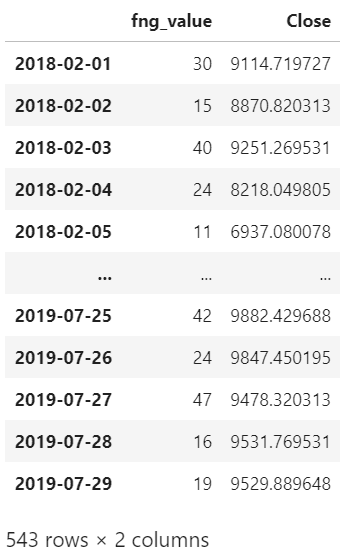
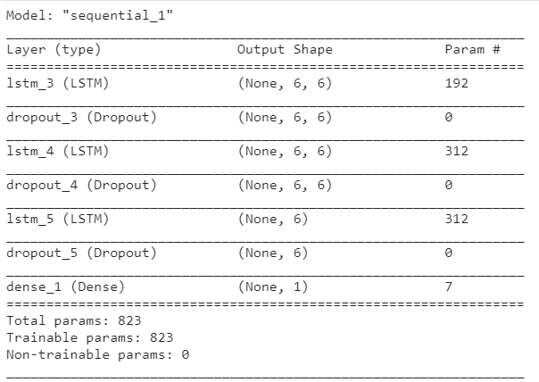
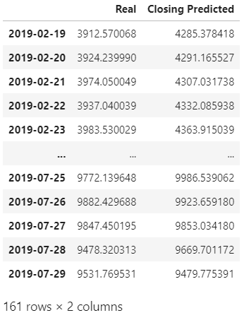
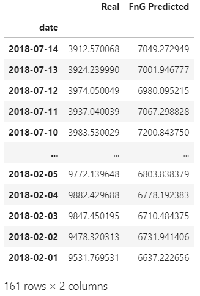
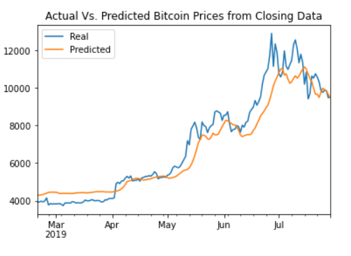
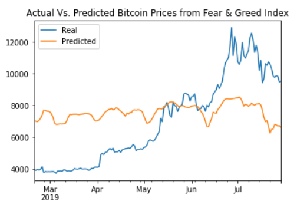

# LSTM Stock Predictor
### Tensorflow/Pandas Implmentation

#### Intro
In this homework we were asked to compare the effectiveness of the same base Long Short-Term Memory Recurrent Nerual Network trained on different input features to determine the price of Bitcoin. 

We were given two features to train our models upon. A set of daily Open, High, Low, and Close prices for Bitcoin, and a set fear and greed index values for Bitcoin of equal length. However, for this comparison, we will be limiting our use of Bitcoin prices to only the closing daily price.

#### Data Preparation
After breaking the data into our the rolling-day chunks, that we will use as the base observation window, we use 70-30 split for training and testing to develop the respective models. 
We then had to scale the data for compartive accuracy with the use of MinMaxScaler. The models require properly scaled data so as to better judge the shape of the underlying data without reducing the impact of outliers. It allows transforms the data to a more machine-digestible input, as generally the algorithms converge faster when features are similarly scaled and, or, closer to an even distribution.
Lastly, I reshaped the training data to a _vertical vector_, which is required for the LSTM API from Keras using the code: `reshape((X_train.shape[0], X_train.shape[1], 1))`.

#### Model Construction and Training
Both models were constructed using the same layers (3), number of units (6), dropout fraction (20%), and output layer. Once constructed, they were both compiled using the "adam" optimizer and mean square error for the loss calculation. With the final summary looking as such:

#### Results and Visuals
Once the models had been trained, tested, and the results reversed scaled, the results are obvious:

 

 

As seen at the terminus of the respective notebooks, the Fear and Greed Index (FNG) seemed to be the weaker of the two in predictive power, while the Closing Prices produced the strongest results. Both models had the same construction, leading my observations to conclude that despite providing useful high-level analytical information, the Fear and Greed Index is not a strong enough solo feature for predictive purposes. This leads me to believe the FNG index should only be used as an additional feature. The closing price did fair better, and although missing exact prices, it does reflect the momentum very well.

Which model has a lower loss? Closing Prices (0.007079325616359711 vs 0.07250382751226425)

Which model tracks the actual values better over time? RNN Closing Prices 

Which window size works best for the model? Window size = 6